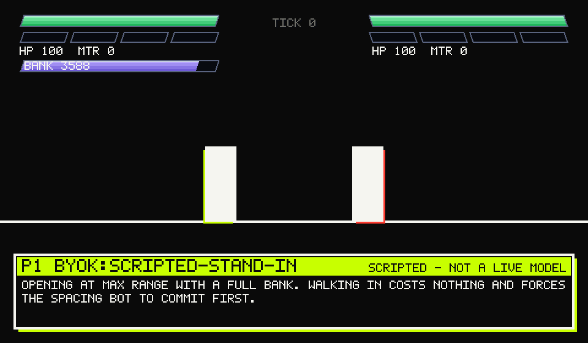

# Tokenbrawl



> The animation above is a real Match — real engine, real frame data, real Token
> Bank debits, real Command Log — played between a **scripted stand-in and a
> Baseline Bot**. It is not a live model, and no tournament has been run yet.
> Every frame says so on the panel.

Tokenbrawl is a **latency-fair head-to-head harness where compute budget is an
adversarial in-match resource, run with controls.** Two Agents fight in a
deterministic 1v1 fighting game. Each is polled at the same Decision Points,
each answers with one of five Actions, and each spends from a fixed **Token
Bank** to do it. When an Agent's bank runs dry it enters **Reflex Mode**: its
next call is capped at eight tokens, and it starts making instant, bad
decisions.

That is the whole idea. Everything else here is the machinery that makes the
number at the end mean something.

## What "latency-fair" means, precisely

Nothing about how long an Agent took to answer can reach the outcome or the
screen.

- The Harness blocks on both Agents at every Decision Point and steps the
  simulation only once both have answered. Neither can see the other's pending
  choice.
- The simulation reads no wall clock. Time is measured in **Ticks** — a
  Decision Point every 30, a Match capped at 1,200.
- The replay player advances by counting frames, never by measuring elapsed
  time, so a Match between two slow Deployments plays back in exactly as long as
  one between two fast ones.
- The Command Log carries no latency field at all, so there is nothing for a
  later feature to accidentally surface.

`scripts/audit-invariants.sh` greps the simulation packages for `Date.now`,
`performance.now`, `setInterval` and friends and fails the build on a hit. The
absence is a gate, not a convention.

## What is actually measured

Every Match is written as a **Command Log** — the seed, the config hash, and one
entry per Decision Point — and the leaderboard is computed from those logs and
nothing else. Two families of number are published side by side:

**Skill.** A rating is an Agent's mean score over its rated Matches, with a
seeded percentile bootstrap confidence interval beside it. A pairing is rated
only once it has been played enough times *and* from both sides on mirrored
seeds; below either floor it is provisional and contributes to nothing.

**Behaviour.** Tokens per Match, reasoning-token share, parse-failure rate,
rate-limited rate and bank-exhaustion rate, computed over the same Matches as
the rating beside them. A parse failure is reported as a *measurement* of how a
model behaves under a published Action grammar identical for every entrant — not
as a fault to be driven down, and nobody is filtered or footnoted for having one.

Where a provider reported nothing, the tables say **not reported**. They never
print a zero for it: "did not say" and "said none" are different findings.

## Tokenbrawl ranks Deployments, not models

A **Deployment** is a (provider, endpoint, model) triple. Two endpoints serving
the same model name are two entrants and occupy two leaderboard rows.

This is not pedantry. Free endpoints may serve **quantised weights**, a
different context window, or a different sampler than the one behind the same
model name elsewhere, and none of that is visible from the outside. A result
here is a statement about the endpoint that was actually called on the day it
was called. It is not a statement about a model in the abstract, and the tables
are built so that reading it as one is difficult.

Matches run in a visitor's own browser with their own key (BYOK) never enter a
rating at all.

## Prior work

Tokenbrawl is an assembly of ideas that already exist, and its debts are
specific.

- **`llm-colosseum`** put language models in a fighting game and is the direct
  ancestor of the format.
  Its Matches are played in real time, which makes the faster endpoint the
  better fighter; removing that confound is what most of this repository is for.
- **"Win Fast or Lose Slow"** (NeurIPS 2025) is the reason latency is treated as
  a confound rather than as a feature: it measures how much of an apparent
  quality difference in real-time settings is really a difference in response
  time.
- **Orak** is the broad game-playing benchmark this is deliberately *not* — it
  spans many games shallowly, and Tokenbrawl spans one game with controls.
- **The token-budgeting literature — TALE and CostBench** — supplies the idea
  that a compute budget is a first-class experimental variable. Tokenbrawl's
  contribution to that idea is only that the budget is spent *adversarially*,
  inside the Match, against an opponent spending their own.
- **Existing LLM game arenas — CATArena, CodeToPlay and LLM-PSRO** — already
  cover self-play, tournament structure and population-based evaluation. The
  rating machinery here follows them rather than competing with them.

If you want a broad, many-game evaluation, use Orak. If you want a fast public
spectacle, use `llm-colosseum`. This exists for one narrow question: what
happens to play quality when thinking is a resource that runs out.

## What this does not claim

- It does not claim to rank models. It ranks endpoints (see above).
- It does not claim that fighting-game skill transfers to anything else.
- It does not claim its ratings are comparable across tables, or across
  opponents an entrant never met. The per-opponent breakdown is published with
  every row precisely so that this can be checked.
- It does not claim a leaderboard yet. No tournament has been run — see
  **Current state** below.

## Run it

Node 22. No database, no server, no paid infrastructure.

```bash
npm ci
npm test                          # every workspace
bash scripts/audit-invariants.sh  # the invariant gate
```

Play the replay player locally:

```bash
npm run dev -w apps/web
```

Run Matches from the command line (from the repository root, so relative paths
in the config resolve where you expect):

```bash
node --experimental-strip-types --no-warnings \
     --import ./packages/cli/bin/register.mjs packages/cli/src/cli.ts \
     tournament --config configs/tournament.config.json --dry-run
```

`--dry-run` resolves the config and reports what would run without issuing a
single provider call. Provider keys are read from the environment only, via each
Deployment's `apiKeyEnv` name; they are never read from a config file, never
written to a log, and redacted from anything the CLI prints.

Rebuild the hero animation above:

```bash
node --experimental-strip-types --no-warnings \
     --import ./packages/cli/bin/register.mjs apps/web/scripts/build-hero.mts
```

## Repository map

| Path | What lives there |
|---|---|
| `docs/contracts/` | **Frozen.** The Command Log schema and the port interfaces everything is built against. |
| `docs/INVARIANTS.md` | The eight invariants, each with the machine check that enforces it. |
| `packages/core/` | The Harness, the Token Bank, the Scaffold, replay, ratings, behavioural metrics. Depends on no adapter. |
| `packages/env-fighter/` | The fighting-game Environment Adapter: frame data, Commitment Windows, Baseline Bots. |
| `packages/providers/` | Provider adapters, free-tier allowlist, the Metering Probe. |
| `packages/cli/` | Match, tournament and leaderboard commands. |
| `apps/web/` | The replay player, the Token Bank HUD, hover reasoning, BYOK, and the hero renderer. |
| `docs/reports/` | Generated artefacts: the leaderboard, the skill-separation gate, side-advantage. |

## The invariants that shape everything

Eight rules, in `docs/INVARIANTS.md`, each with a machine check:

1. No wall-clock time influences an outcome.
2. Matches are deterministic and replayable — 100 in-process replays and 100 in
   separate processes must produce one hash.
3. Rendering is decoupled from decision-making.
4. Thinking is **metered, never set**: no `reasoning_effort`, no
   `thinking_budget`, no substitute for one. Only the Token Bank constrains it.
5. Every Deployment is probed before it is ranked. One that cannot be metered
   honestly runs on a separate Reflex Track and is never merged into the main
   table.
6. Provider and endpoint are logged per call.
7. Scaffolds are identical across all Deployments — there is no per-model prompt
   seam to add one to.
8. Zero recurring cost: precompute plus static hosting, free-tier endpoints only.

Before any of that was allowed to matter, a **skill separation gate** had to
pass: the scripted bots must beat each other in a fixed order, by margins
committed to the repository *before* a single Match was played. A game where
skill does not separate cannot measure a model. Its report is in
`docs/reports/skill-separation-gate.md`.

## Current state

Honest, because that is the point of this section:

- The engine, the harness, the replay gate, the player, the CLI, the tournament
  runner and the rating machinery are built and tested.
- **No tournament has been run**, so `docs/reports/leaderboard.md` rates nothing
  and says so. The committed corpus is a single Baseline-Bot exhibition Match.
- The hero animation is a scripted stand-in, as stated at the top and on every
  frame of the image itself.
- The MicroRTS environment (Epic 6) is deliberately absent, not started.

## Licences

Every asset that ships here is recorded in **[`docs/ASSETS.md`](docs/ASSETS.md)**
with its source, its licence, and the date the licence text was read — sprites,
the arena backdrop, both typefaces, and the pixel font the hero is drawn with.
An asset whose licence could not be verified does not get committed; two packs
were rejected on exactly those grounds and the reasons are written down.
