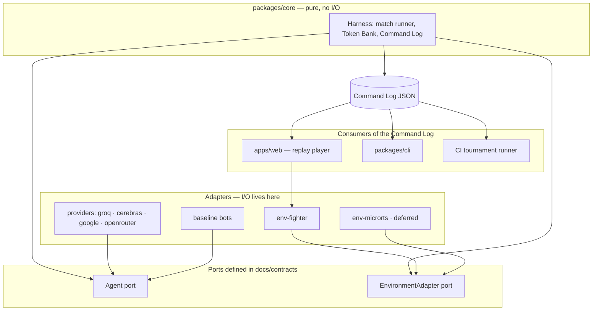

# Tokenbrawl Architecture

Read this before adding anything to the system. It exists mainly to stop a future contributor — human or agent — from inventing infrastructure this project deliberately does not have.

## The shape in one sentence

Matches are precomputed in CI, written to JSON in this repository, and served as static files; the browser re-runs the deterministic engine from those files to draw the fight.

## Paradigm: ports and adapters

The core is pure. It performs no I/O, touches no clock, and knows nothing about fighting games or model providers.



**Dependency direction is one-way: adapters depend on core, never the reverse.** If core needs to know something about an adapter, the contract is wrong.

The payoff is the project's central technical claim: MicroRTS must be able to slot in later without the Harness changing a line. If harness logic starts being duplicated per environment, stop and refactor — that duplication *is* the failure.

## Hosting: free, and there is no server

- **GitHub Actions runs the matches.** Public repository, free minutes, cron-scheduled. No cold starts, no request timeouts.
- **Actions commits the replay JSON** back into this repository.
- **That commit triggers a Vercel redeploy**, which serves the site statically.
- **The browser does the rest.** Playback, BYOK matches, everything.

### Things this project does not have, on purpose

| Not present | Why |
|---|---|
| A server, worker, or WebSocket | Matches are precomputed. There is nothing to serve dynamically. |
| A database | Replays are JSON files in the repository. Git is the store. |
| A JVM | Vercel has no JVM runtime under any plan. This is why the fighter is TypeScript. |
| 3D or floating-point simulation | Float non-determinism breaks INV-2. |
| Live-match streaming | Precomputed replays only in v1. |

**If a story appears to need any of these, it has misunderstood the precompute design. Escalate rather than provisioning one.**

## Why the player re-runs the engine

The Command Log stores *decisions*, not frames. To draw a fight, the browser loads the log and re-executes the same deterministic engine from `(seed, config, ordered actions)`.

This falls out of the ports-and-adapters split, and it buys three things at once:

1. **Logs stay small** — roughly 30 decision points per Agent instead of 1,200 ticks of positions. That is what makes a fight visible within two seconds.
2. **INV-2 gets verified continuously** — every replay anyone watches is a determinism test. A divergence shows up as a visibly wrong fight, not a silent corruption.
3. **BYOK works with no server** — the same engine that ran in CI runs in the visitor's tab.

The cost is that the web bundle must include the engine. That is acceptable: the engine is integer arithmetic over a tiny state, with no rendering code in it.

## Determinism, concretely

Every rule here exists to serve INV-2. None of them is negotiable.

- **Fixed timestep.** No delta-time anywhere. 60 Ticks per playback second is a *rendering* rate; the simulation never reads it.
- **Integers only.** No floating-point values in simulation state. Positions, velocities, damage and timers are integers. Where a fraction is genuinely needed, use fixed-point with an explicit integer scale, never a float.
- **Seeded PRNG threaded through state.** The generator is part of the state object and is passed forward explicitly. Never a module-level global — that is the leak that makes tests pass in-process and fail across processes.
- **Deterministic iteration order.** No unordered map or set iteration may influence state.
- **Hashing.** SHA-256 over a canonical serialisation: keys sorted, integers only. The Final-State Hash is the machine expression of the whole invariant.
- **Test across processes as well as within one.** Same-process-only replay testing hides exactly the global-state leakage this section is built to prevent.

## Timing model

| Quantity | Value | Note |
|---|---|---|
| Playback rate | 60 Ticks / second | Rendering only. The simulation never reads it. |
| Decision cadence | every 30 Ticks | And only for an Agent not inside a Commitment Window. |
| Match cap | 1,200 Ticks | Early exit on KO. |
| Decision Points per Agent | ~30 (max 40) | The primary lever on API call volume. |

Not polling an Agent that is mid-Commitment-Window is the main reason call volume fits inside free-tier quotas. It is a rule, not an optimisation.

## Provider strategy

**One ranked Deployment per provider**, so free-tier quotas stay independent rather than shared.

| Provider | Free tier as measured 2026-07-30 | Role |
|---|---|---|
| Groq | 30 RPM / 14,400 RPD (`llama-3.1-8b-instant`); 1,000 RPD most others | Tournament workhorse |
| Cerebras | 30 RPM / ~1,000 RPD | Ranked Deployment |
| Google AI Studio | 10 RPM / 1,500 RPD (Gemini 2.5 Flash) | Ranked Deployment |
| OpenRouter | 20 RPM / **50 RPD** | Metering Probe and BYOK only — cannot run a tournament |

These numbers are **configuration, not constants in code**, and must be re-verified at the start of each epic. They move.

A tournament issues roughly 4,500 calls per Deployment. The ~1,000-RPD providers are the binding constraint, so the tournament runs **weekly, resumably, across up to five days**. Resumability is load-bearing, not defensive: no CI job may assume it completes in one run.

## Source layout

```text
tokenbrawl/
  docs/
    contracts/          # FROZEN. Everything binds here. Changes require escalation.
      command-log.schema.json
      index.ts
    INVARIANTS.md
    ARCHITECTURE.md
    stories/
  packages/
    core/               # Harness: match runner, Token Bank, Command Log I/O. Pure.
    env-fighter/        # The deterministic 2D fighter + Baseline Bots. Pure.
    providers/          # Provider adapters, Metering Probe, prompt caching. I/O.
    cli/                # Local runner for BYOK-heavy and development runs.
  apps/
    web/                # Replay player, leaderboard, BYOK panel. Static.
  replays/              # Command Logs committed by CI. The datastore.
  scripts/
    audit-invariants.sh
  .github/workflows/    # Cron tournament runner.
```

## Stack

| Name | Version | Note |
|---|---|---|
| TypeScript | 5.x | Strict mode. |
| Node | 22 LTS | CI and CLI runtime. |
| Vite | 8.x | Web app build. |
| Vitest | 4.x | Test runner across all packages. |
| npm workspaces | — | Monorepo. No extra tooling until it earns its place. |

Versions were current at authoring. Once the code exists, the code owns them.

## The gate

Every story exits on: **`npm test` green, and `scripts/audit-invariants.sh` exiting zero.** A reviewer's approval is not a gate. Build the audit script's coverage up as invariants become mechanically checkable, and keep the `UNMECHANISED` list in it honest — a gate that quietly checks nothing is worse than no gate at all.
